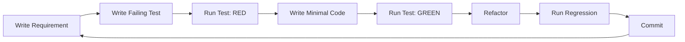

# Git-Migrator - Project Plan

**Status:** Internal Planning Document  
**Last Updated:** 2025-01-18  
**Version:** 1.0

---

## Executive Summary

Git-Migrator is an open-source tool for migrating version control repositories with full history preservation and keeping them synchronized. The MVP focuses on CVS to Git migration, with a modular architecture designed to support additional VCS systems (SVN, Mercurial, etc.) and bidirectional sync in future phases.

### Key Objectives

1. **History Preservation** - Migrate repositories with 100% history accuracy (commits, branches, tags, authors, dates)
2. **Extensibility** - Modular VCS plugin system for easy addition of new version control systems
3. **Multi-Runtime** - Run locally or in Docker with equal functionality
4. **Dual Interface** - CLI-first with web UI available from day one
5. **Quality Assurance** - Test-driven development with mandatory regression testing and requirements validation

---

## Project Overview

### Repository Information

- **Name:** Git-Migrator
- **License:** MIT
- **Repository:** `github.com/adamf123git/git-migrator`
- **Language:** Go
- **Target Platforms:** Linux, macOS, Windows

### Target Audience

**Primary (MVP):** Open source community, developers with legacy CVS repositories  
**Secondary (Future):** Enterprise teams with mixed VCS environments requiring synchronization

### Core Requirements

| ID | Requirement | Priority | Phase |
|----|-------------|----------|-------|
| REQ-001 | CVS to Git migration with full history | P0 | MVP |
| REQ-002 | Author mapping (CVS usernames → Git authors) | P0 | MVP |
| REQ-003 | Branch migration | P0 | MVP |
| REQ-004 | Tag migration | P0 | MVP |
| REQ-005 | Resume interrupted migrations | P1 | MVP |
| REQ-006 | Docker support | P0 | MVP |
| REQ-007 | CLI interface | P0 | MVP |
| REQ-008 | Web UI for monitoring | P1 | MVP |
| REQ-009 | TDD with regression testing | P0 | MVP |
| REQ-010 | Requirements validation | P0 | MVP |
| REQ-100 | Git ↔ CVS bidirectional sync | P2 | Phase 2 |
| REQ-200 | SVN support | P2 | Phase 3 |
| REQ-300 | Additional VCS (Mercurial, Perforce, etc.) | P3 | Phase 4 |

---

## MVP Scope (Phase 1)

### In Scope

- ✅ CVS repository analysis and validation
- ✅ Full history migration (commits, authors, dates, messages)
- ✅ Branch migration with name mapping
- ✅ Tag migration with name mapping
- ✅ Author mapping configuration
- ✅ Progress reporting (CLI + Web)
- ✅ Resume interrupted migrations
- ✅ Dry-run mode
- ✅ Docker containerization
- ✅ Web UI for migration monitoring
- ✅ Test-driven development
- ✅ Regression testing suite
- ✅ Requirements traceability

### Out of Scope (Future Phases)

- ❌ Bidirectional sync
- ❌ SVN, Mercurial, or other VCS support
- ❌ Git LFS support
- ❌ Multi-repository batch migration
- ❌ Advanced conflict resolution
- ❌ Authentication/authorization for web UI

---

## Architecture Principles

### 1. Modularity First

```
┌─────────────────────────────────────────┐
│          Git-Migrator Core              │
│                                         │
│  ┌──────────────┐    ┌──────────────┐  │
│  │  VCS Plugin  │    │  VCS Plugin  │  │
│  │   (CVS)      │    │   (SVN)      │  │
│  └──────────────┘    └──────────────┘  │
│                                         │
│  ┌──────────────────────────────────┐  │
│  │      VCS Interface (Plugin API)  │  │
│  └──────────────────────────────────┘  │
└─────────────────────────────────────────┘
```

**Benefit:** New VCS systems can be added without modifying core logic.

### 2. Plugin Architecture

Each VCS system implements standard interfaces:
- `VCSReader` - Read from source repository
- `VCSWriter` - Write to target repository
- `VCSSyncer` - Bidirectional sync (future)

**Implementation:**
```go
type VCSReader interface {
    Validate(path string) error
    GetInfo() (*RepositoryInfo, error)
    ListBranches() ([]Branch, error)
    ListTags() ([]Tag, error)
    GetCommits(opts CommitOptions) ([]Commit, error)
    GetFile(commit Commit, path string) ([]byte, error)
    ListFiles(commit Commit) ([]string, error)
}
```

### 3. Clean Separation of Concerns

```
Presentation Layer (CLI/Web UI)
        ↓
Application Layer (Migration Orchestrator)
        ↓
Domain Layer (VCS Interfaces, Entities)
        ↓
Infrastructure Layer (VCS Implementations, SQLite)
```

### 4. Configuration-Driven

All behavior configurable via:
- YAML configuration files
- CLI flags
- Environment variables
- Web UI settings

---

## Technology Stack

### Core Technologies

| Component | Technology | Rationale |
|-----------|-----------|-----------|
| Language | Go 1.21+ | Performance, cross-platform, single binary |
| CLI Framework | Cobra | Industry standard, great UX |
| Configuration | Viper | Flexible, multiple sources |
| Git Operations | go-git | Pure Go, no CGO dependency |
| State Storage | SQLite (modernc) | Embedded, cross-platform, pure Go |
| Web Framework | net/http (stdlib) | Simple, no dependencies for MVP |
| WebSocket | gorilla/websocket | Well-maintained, widely used |
| Testing | testing (stdlib) + testify | Standard + assertions |

### Development Tools

| Tool | Purpose |
|------|---------|
| GoReleaser | Cross-platform builds and releases |
| Docker | Containerization |
| GitHub Actions | CI/CD |
| Pre-commit hooks | TDD enforcement |
| golangci-lint | Code quality |

---

## Quality Assurance Strategy

### Test-Driven Development (Mandatory)

**Workflow:**


**Coverage Requirements:**
- Overall: ≥ 80%
- Core packages (vcs, core): ≥ 90%
- Per requirement: 100% of acceptance criteria tested

### Regression Testing

**Three-Tier Approach:**

1. **Smoke Tests** (< 30 seconds)
   - Critical path validation
   - Run on every commit

2. **Full Regression** (< 5 minutes)
   - All unit + integration tests
   - Run on every PR

3. **Nightly Tests** (up to 30 minutes)
   - Large repository fixtures (10k+ commits)
   - Performance benchmarks
   - Memory profiling

### Requirements Validation

Every feature must:
1. Have documented requirement in `test/requirements/REQ-XXX/`
2. Have acceptance criteria
3. Have tests proving acceptance criteria met
4. Be tracked in requirements traceability matrix

---

## Success Metrics

### MVP Success Criteria

- ✅ Migrate repository with 10k+ commits successfully
- ✅ 100% of commit history preserved
- ✅ All branches and tags migrated
- ✅ Migration completes in < 1 hour for typical repo
- ✅ Test coverage ≥ 80%
- ✅ All requirements have passing tests
- ✅ Docker image < 50MB
- ✅ Web UI functional for monitoring migrations

### Long-term Success (6-12 months)

- GitHub stars > 500
- Active community contributions (10+ contributors)
- Multiple VCS systems supported (CVS, SVN, Mercurial)
- Used by organizations for real-world migrations
- Bidirectional sync working reliably

---

## Risk Management

### Technical Risks

| Risk | Impact | Mitigation |
|------|--------|------------|
| CVS format complexity | High | Dual strategy: CVS binary + RCS parsing |
| Large repository performance | Medium | Streaming processing, chunking, benchmarks |
| Cross-platform issues | Medium | Docker-first, extensive CI on all platforms |
| History corruption | High | Verification step, checksums, rollback capability |

### Project Risks

| Risk | Impact | Mitigation |
|------|--------|------------|
| Scope creep | High | Strict MVP definition, modular architecture |
| Test coverage gaps | Medium | Automated coverage enforcement, requirements matrix |
| Performance regressions | Medium | Nightly benchmarks, baseline tracking |

---

## Dependencies

### External Dependencies

**Minimal Philosophy:** Reduce external dependencies where possible

**Required:**
- Go 1.21+ runtime (for local builds)
- Docker (for containerized execution)
- Git (for verification testing)

**Optional:**
- CVS binary (if not using RCS parsing mode)

### Go Module Dependencies

```go
require (
    github.com/spf13/cobra v1.8.0
    github.com/spf13/viper v1.18.2
    github.com/go-git/go-git/v5 v5.11.0
    github.com/gorilla/websocket v1.5.1
    modernc.org/sqlite v1.28.0
    github.com/stretchr/testify v1.8.4
)
```

---

## Timeline Overview

### Phase 1: MVP (12 weeks)
- Sprint 1-2: Foundation + CVS Reading
- Sprint 3-4: Git Writing + Integration
- Sprint 5-6: Testing, Polish, Release

### Phase 2: Bidirectional Sync (8 weeks)
- Sprint 7-8: Sync Architecture
- Sprint 9-10: Git ↔ CVS Sync
- Sprint 11-12: Testing + Release

### Phase 3: SVN Support (6 weeks)
- Sprint 13-14: SVN Reader
- Sprint 15-16: SVN → Git Migration

### Phase 4: Extended VCS + Features (Ongoing)
- Additional VCS systems
- Advanced features (LFS, monorepo splitting, etc.)

---

## Open Questions

### Resolved ✅
- ~~Name: Git-Migrator~~
- ~~License: MIT~~
- ~~Hosting: GitHub~~
- ~~Development methodology: TDD~~
- ~~Runtime: Local + Docker~~

### Pending
- [ ] Website/landing page hosting (GitHub Pages?)
- [ ] Release cadence (monthly? on-demand?)
- [ ] Community governance model

---

## Related Documents

- [Software Architecture](./software-architecture.md) - Detailed system design
- [Software Design](./software-design.md) - Implementation details
- [Roadmap](./roadmap.md) - Detailed sprint plans
- [../README.md](../README.md) - User-facing documentation

---

## Change Log

| Date | Version | Changes |
|------|---------|---------|
| 2025-01-18 | 1.0 | Initial project plan |
