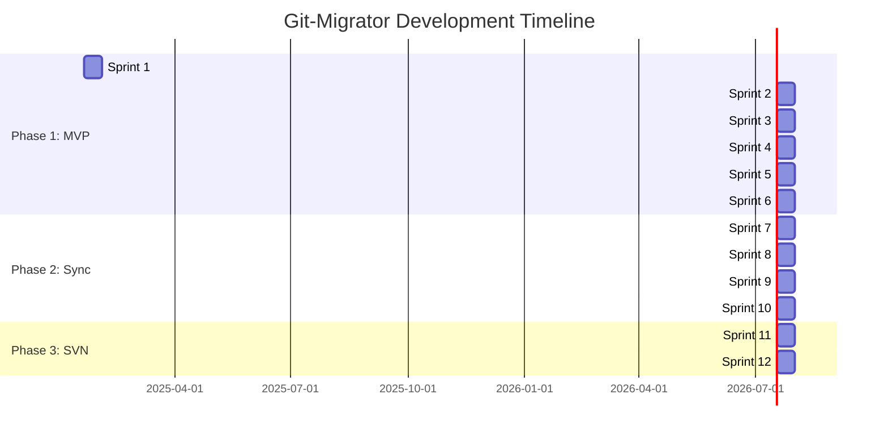

# Git-Migrator - Development Roadmap

**Status:** Internal Planning Document  
**Last Updated:** 2025-01-18  
**Version:** 1.0

---

## Overview

This roadmap outlines the development timeline for Git-Migrator, organized into phases and sprints. Each sprint is 2 weeks long and follows **Test-Driven Development (TDD)** with mandatory **regression testing** and **requirements validation**.

---

## Timeline Overview

---

## Phase 1: MVP - CVS to Git Migration

**Duration:** 12 weeks (6 sprints)  
**Goal:** Working CVS to Git migration tool with CLI + Web UI

### Sprint 1: Foundation & Testing Infrastructure (Weeks 1-2)

#### Objectives
- Set up project structure
- Implement TDD tooling
- Create requirements tracking system
- Establish CI/CD pipeline
- Basic CLI framework

#### Requirements
| ID | Requirement | Tests | Status |
|----|-------------|-------|--------|
| REQ-007 | CLI Interface | 12 | ⚪ |
| REQ-009 | TDD with regression testing | 8 | ⚪ |
| REQ-010 | Requirements validation | 5 | ⚪ |

#### Tasks

**Day 1-2: Project Setup**
- [ ] Create project directory structure
- [ ] Initialize Go module (`go mod init`)
- [ ] Create initial `Makefile` with test targets
- [ ] Set up pre-commit hooks for TDD
- [ ] Create initial `.github/workflows/ci.yml`

**Day 3-4: Requirements Tracking**
- [ ] Create `test/requirements/` directory
- [ ] Create `test/requirements/matrix_test.go`
- [ ] Create `test/requirements/STATUS.md` template
- [ ] Write `scripts/check-requirements.go`
- [ ] Test: Requirements matrix validation

**Day 5-6: Testing Infrastructure**
- [ ] Create `Makefile` targets:
  - `test-smoke`
  - `test-regression`
  - `test-requirements`
  - `test-coverage`
- [ ] Set up `test/helpers/` utilities
- [ ] Create `test/regression/smoke/` directory
- [ ] Test: Test infrastructure itself

**Day 7-8: CLI Foundation**
- [ ] Create `test/requirements/REQ-007-cli-interface/requirement.md`
- [ ] Write tests for CLI commands (cobra)
- [ ] Implement `cmd/git-migrator/main.go`
- [ ] Implement `cmd/git-migrator/commands/root.go`
- [ ] Implement `cmd/git-migrator/commands/version.go`
- [ ] Test: All CLI commands have tests

**Day 9-10: Documentation & Polish**
- [ ] Create `README.md` (user-facing)
- [ ] Create `CONTRIBUTING.md` (with TDD guidelines)
- [ ] Update `test/requirements/STATUS.md`
- [ ] Run: `make test-requirements` (all should pass)
- [ ] Push to GitHub

#### Deliverables
- ✅ Working CLI with `version` command
- ✅ Full TDD infrastructure
- ✅ Requirements tracking system
- ✅ CI/CD pipeline
- ✅ All tests passing, >80% coverage

---

### Sprint 2: CVS Reading & RCS Parsing (Weeks 3-4)

#### Objectives
- Parse CVS RCS files directly
- Extract commits, branches, tags
- CVS repository validation

#### Requirements
| ID | Requirement | Tests | Status |
|----|-------------|-------|--------|
| REQ-001 | CVS to Git Migration (partial) | 30 | 🟡 |
| REQ-011 | RCS file parsing | 20 | ⚪ |
| REQ-012 | CVS repository validation | 8 | ⚪ |

#### Tasks

**Day 1-3: VCS Interface Design**
- [ ] Create `test/requirements/REQ-001-cvs-to-git-migration/`
- [ ] Write tests for `VCSReader` interface
- [ ] Write tests for `CommitIterator` interface
- [ ] Implement `internal/vcs/vcs.go` (interfaces)
- [ ] Test: Interface contracts validated

**Day 4-7: RCS Lexer & Parser**
- [ ] Create `test/requirements/REQ-011-rcs-parsing/`
- [ ] Write tests for RCS lexer
- [ ] Implement `internal/vcs/cvs/rcs_lexer.go`
- [ ] Write tests for RCS parser
- [ ] Implement `internal/vcs/cvs/rcs_parser.go`
- [ ] Test: Parse real CVS RCS files

**Day 8-10: CVS Reader**
- [ ] Write tests for CVS repository validation
- [ ] Implement `internal/vcs/cvs/reader.go`
- [ ] Write tests for commit extraction
- [ ] Implement commit iterator
- [ ] Test: Extract commits from test fixtures

**Day 11-12: Test Fixtures**
- [ ] Create `test/fixtures/cvs/simple/`
- [ ] Create `test/fixtures/cvs/branches/`
- [ ] Create `test/fixtures/cvs/tags/`
- [ ] Write integration tests using fixtures
- [ ] Test: All fixtures migrate correctly

**Day 13-14: Integration & Regression**
- [ ] Run: `make test-regression`
- [ ] Fix any failures
- [ ] Update requirements matrix
- [ ] Run: `make test-requirements`
- [ ] Commit and push

#### Deliverables
- ✅ RCS file parser (pure Go)
- ✅ CVS repository reader
- ✅ Commit iterator
- ✅ Branch/tag extraction
- ✅ Test fixtures for CVS repos

---

### Sprint 3: Git Writing & Commit Application (Weeks 5-6)

#### Objectives
- Create Git repositories
- Apply commits to Git
- Create branches and tags
- Verify integrity

#### Requirements
| ID | Requirement | Tests | Status |
|----|-------------|-------|--------|
| REQ-001 | CVS to Git Migration (partial) | 30 | 🟡 |
| REQ-013 | Git repository creation | 8 | ⚪ |
| REQ-014 | Commit application | 15 | ⚪ |
| REQ-015 | Branch/tag creation | 10 | ⚪ |

#### Tasks

**Day 1-3: Git Writer**
- [ ] Create `test/requirements/REQ-013-git-repo/`
- [ ] Write tests for `VCSWriter` interface
- [ ] Implement `internal/vcs/git/writer.go`
- [ ] Write tests for repository initialization
- [ ] Test: Create empty Git repos

**Day 4-7: Commit Application**
- [ ] Create `test/requirements/REQ-014-commit-application/`
- [ ] Write tests for commit creation
- [ ] Implement `ApplyCommit()` method
- [ ] Write tests for file operations (add, modify, delete)
- [ ] Implement file handling
- [ ] Test: Apply commits to Git repo

**Day 8-10: Branches & Tags**
- [ ] Create `test/requirements/REQ-015-branch-tag/`
- [ ] Write tests for branch creation
- [ ] Write tests for tag creation
- [ ] Implement `CreateBranch()` and `CreateTag()`
- [ ] Test: Branches and tags exist in Git

**Day 11-12: Verification**
- [ ] Write tests for Git repository verification
- [ ] Implement `internal/vcs/git/verify.go`
- [ ] Test: Verify commit count, branch count, tag count
- [ ] Test: Verify commit contents match

**Day 13-14: Integration & Regression**
- [ ] Run: `make test-regression`
- [ ] Fix any failures
- [ ] Update requirements matrix
- [ ] Commit and push

#### Deliverables
- ✅ Git repository writer
- ✅ Commit application
- ✅ Branch/tag creation
- ✅ Verification logic
- ✅ All Git operations tested

---

### Sprint 4: Migration Integration (Weeks 7-8)

#### Objectives
- End-to-end migration pipeline
- Author mapping
- Progress reporting
- Resume capability
- State persistence

#### Requirements
| ID | Requirement | Tests | Status |
|----|-------------|-------|--------|
| REQ-001 | CVS to Git Migration | 30 | 🟡 |
| REQ-002 | Author mapping | 10 | ⚪ |
| REQ-005 | Resume capability | 12 | ⚪ |
| REQ-016 | Progress reporting | 8 | ⚪ |
| REQ-017 | State persistence | 10 | ⚪ |

#### Tasks

**Day 1-3: Migration Orchestrator**
- [ ] Create `test/requirements/REQ-001-cvs-to-git-migration/`
- [ ] Write tests for migration orchestrator
- [ ] Implement `internal/core/migration.go`
- [ ] Test: Orchestration logic

**Day 4-5: Author Mapping**
- [ ] Create `test/requirements/REQ-002-author-mapping/`
- [ ] Write tests for author mapping
- [ ] Implement `internal/mapping/authors.go`
- [ ] Test: CVS users mapped to Git authors

**Day 6-8: Progress Reporting**
- [ ] Create `test/requirements/REQ-016-progress/`
- [ ] Write tests for progress reporter
- [ ] Implement `internal/progress/reporter.go`
- [ ] Implement `internal/progress/terminal.go`
- [ ] Test: Progress displayed in CLI

**Day 9-11: State & Resume**
- [ ] Create `test/requirements/REQ-005-resume/`
- [ ] Write tests for state persistence
- [ ] Implement `internal/core/state.go`
- [ ] Implement `internal/storage/sqlite.go`
- [ ] Write tests for resume capability
- [ ] Test: Resume interrupted migration

**Day 12-14: Integration & Regression**
- [ ] Write end-to-end tests for full migration
- [ ] Run: `make test-regression`
- [ ] Fix any failures
- [ ] Update requirements matrix
- [ ] Commit and push

#### Deliverables
- ✅ Migration orchestrator
- ✅ Author mapping
- ✅ Progress reporting
- ✅ Resume capability
- ✅ SQLite state storage

---

### Sprint 5: Web UI & Docker (Weeks 9-10)

#### Objectives
- Web UI for migration monitoring
- WebSocket real-time updates
- Docker containerization
- REST API

#### Requirements
| ID | Requirement | Tests | Status |
|----|-------------|-------|--------|
| REQ-006 | Docker support | 10 | ⚪ |
| REQ-008 | Web UI | 15 | ⚪ |
| REQ-018 | REST API | 12 | ⚪ |
| REQ-019 | WebSocket progress | 8 | ⚪ |

#### Tasks

**Day 1-4: Web Server & API**
- [ ] Create `test/requirements/REQ-018-rest-api/`
- [ ] Write tests for HTTP server
- [ ] Write tests for API endpoints
- [ ] Implement `internal/web/server.go`
- [ ] Implement `internal/web/api.go`
- [ ] Test: API endpoints functional

**Day 5-7: WebSocket Progress**
- [ ] Create `test/requirements/REQ-019-websocket/`
- [ ] Write tests for WebSocket handler
- [ ] Implement `internal/web/websocket.go`
- [ ] Implement `internal/progress/websocket.go`
- [ ] Test: Real-time progress in browser

**Day 8-10: Web UI**
- [ ] Create `test/requirements/REQ-008-web-ui/`
- [ ] Write E2E tests (Playwright)
- [ ] Create `internal/web/static/index.html`
- [ ] Create `internal/web/static/app.js`
- [ ] Create `internal/web/static/style.css`
- [ ] Test: UI shows migration progress

**Day 11-12: Docker**
- [ ] Create `test/requirements/REQ-006-docker/`
- [ ] Write tests for Docker execution
- [ ] Create `Dockerfile`
- [ ] Create `docker-compose.yml`
- [ ] Test: Docker container runs migrations

**Day 13-14: Integration & Regression**
- [ ] Run: `make test-regression`
- [ ] Test: Full migration via Web UI
- [ ] Test: Full migration via Docker
- [ ] Fix any failures
- [ ] Update requirements matrix
- [ ] Commit and push

#### Deliverables
- ✅ Web UI for monitoring
- ✅ WebSocket real-time updates
- ✅ REST API
- ✅ Docker support
- ✅ E2E tests for Web UI

---

### Sprint 6: Testing, Polish & Release (Weeks 11-12)

#### Objectives
- Comprehensive testing
- Performance optimization
- Documentation
- Release preparation

#### Tasks

**Day 1-3: Comprehensive Testing**
- [ ] Run: `make test-nightly` (large repos)
- [ ] Performance benchmarks
- [ ] Memory profiling
- [ ] Fix performance issues
- [ ] Test: 10k+ commit repos

**Day 4-6: Documentation**
- [ ] Update `README.md`
- [ ] Create `docs/getting-started.md`
- [ ] Create `docs/migration.md`
- [ ] Create `docs/configuration.md`
- [ ] Add inline godoc comments
- [ ] Generate godoc documentation

**Day 7-9: Polish & Bug Fixes**
- [ ] Address all TODOs
- [ ] Fix linter warnings
- [ ] Improve error messages
- [ ] Add helpful debug logging
- [ ] Code review

**Day 10-12: Release Preparation**
- [ ] Create `.goreleaser.yml`
- [ ] Build binaries for all platforms
- [ ] Test binaries on Linux, macOS, Windows
- [ ] Create GitHub release
- [ ] Push Docker image to Docker Hub
- [ ] Create Homebrew formula

**Day 13-14: Launch**
- [ ] Final regression testing
- [ ] Create GitHub release notes
- [ ] Announce on social media
- [ ] Update project website

#### Deliverables
- ✅ 90%+ test coverage
- ✅ Performance benchmarks
- ✅ Complete documentation
- ✅ Release binaries
- ✅ Docker image
- ✅ Homebrew formula
- ✅ GitHub release

---

## Phase 2: Bidirectional Sync

**Duration:** 8 weeks (4 sprints)  
**Goal:** Git ↔ CVS bidirectional synchronization

### Sprint 7-8: Sync Architecture & Implementation

#### Requirements
| ID | Requirement | Tests | Status |
|----|-------------|-------|--------|
| REQ-100 | Git ↔ CVS Sync | 40 | ⚪ |
| REQ-101 | Change detection | 15 | ⚪ |
| REQ-102 | Conflict detection | 12 | ⚪ |

#### Key Tasks
- Design `VCSSyncer` interface
- Implement change detection
- Implement conflict detection
- Implement sync orchestrator
- Write comprehensive tests
- Test with real repositories

### Sprint 9-10: Sync Testing & Release

#### Key Tasks
- Sync integration tests
- Performance testing
- Documentation updates
- Release sync feature

---

## Phase 3: SVN Support

**Duration:** 6 weeks (3 sprints)  
**Goal:** SVN to Git migration

### Sprint 11-12: SVN Reading & Integration

#### Requirements
| ID | Requirement | Tests | Status |
|----|-------------|-------|--------|
| REQ-200 | SVN support | 35 | ⚪ |
| REQ-201 | SVN externals | 10 | ⚪ |

#### Key Tasks
- Implement `internal/vcs/svn/reader.go`
- Parse SVN dump format
- Handle SVN externals
- SVN properties mapping
- Write comprehensive tests
- Test with real SVN repositories

---

## Phase 4: Extended Features (Ongoing)

### Future Requirements

| ID | Requirement | Priority |
|----|-------------|----------|
| REQ-300 | Mercurial support | P3 |
| REQ-400 | Git LFS support | P3 |
| REQ-500 | Monorepo splitting | P3 |
| REQ-600 | Multi-repo batch migration | P3 |
| REQ-700 | Web UI authentication | P2 |

---

## Release Cadence

### MVP Release (v1.0.0)
- **Target:** End of Sprint 6 (Week 12)
- **Scope:** CVS to Git migration
- **Platforms:** Linux, macOS, Windows
- **Distribution:** Binary, Docker, Homebrew

### Sync Release (v2.0.0)
- **Target:** End of Sprint 10 (Week 20)
- **Scope:** Bidirectional Git ↔ CVS sync

### SVN Release (v3.0.0)
- **Target:** End of Sprint 12 (Week 24)
- **Scope:** SVN to Git migration

### Minor Releases
- **Frequency:** Monthly (after v1.0.0)
- **Scope:** Bug fixes, minor features, performance improvements

---

## Quality Gates

### Every Sprint

- [ ] All tests passing (`make test`)
- [ ] Coverage ≥ 80% (`make test-coverage`)
- [ ] No linter errors (`golangci-lint run`)
- [ ] Requirements validated (`make test-requirements`)
- [ ] Regression suite passing (`make test-regression`)
- [ ] Documentation updated
- [ ] `test/requirements/STATUS.md` updated

### Every Release

- [ ] All sprint quality gates
- [ ] Nightly tests passing (`make test-nightly`)
- [ ] Performance benchmarks acceptable
- [ ] Cross-platform testing (Linux, macOS, Windows)
- [ ] Docker image tested
- [ ] Documentation complete
- [ ] Changelog updated

---

## Risk Mitigation

### Technical Risks

**Risk:** RCS format complexity  
**Mitigation:** Sprint 2 has extra buffer time (14 days for parsing)  
**Contingency:** Fallback to CVS binary if RCS parsing fails

**Risk:** Large repository performance  
**Mitigation:** Sprint 6 includes performance testing  
**Contingency:** Add streaming/chunking if needed

### Schedule Risks

**Risk:** Scope creep  
**Mitigation:** Strict MVP definition, modular architecture  
**Contingency:** Defer non-essential features to Phase 4

**Risk:** Test coverage gaps  
**Mitigation:** Requirements traceability matrix  
**Contingency:** Add testing sprint buffer

---

## Success Metrics

### Sprint-Level

- Test coverage: ≥ 80%
- Requirements coverage: 100%
- Zero regressions
- All acceptance criteria met

### Release-Level

- Successfully migrate 10k+ commit repo
- Preserve 100% of history
- All branches/tags migrated
- Migration time < 1 hour (typical repo)
- GitHub stars > 100 (v1.0)
- Docker pulls > 100 (v1.0)

---

## Monitoring Progress

### Weekly Status Updates

Update `test/requirements/STATUS.md` with:
- Requirements completed
- Tests written/passed
- Coverage percentage
- Blockers and risks

### Sprint Retrospectives

- What went well?
- What didn't go well?
- What to improve next sprint?
- Update roadmap if needed

---

## Related Documents

- [Project Plan](./project-plan.md) - Overall project goals
- [Software Architecture](./software-architecture.md) - System architecture
- [Software Design](./software-design.md) - Implementation details

---

## Change Log

| Date | Version | Changes |
|------|---------|---------|
| 2025-01-18 | 1.0 | Initial roadmap |
