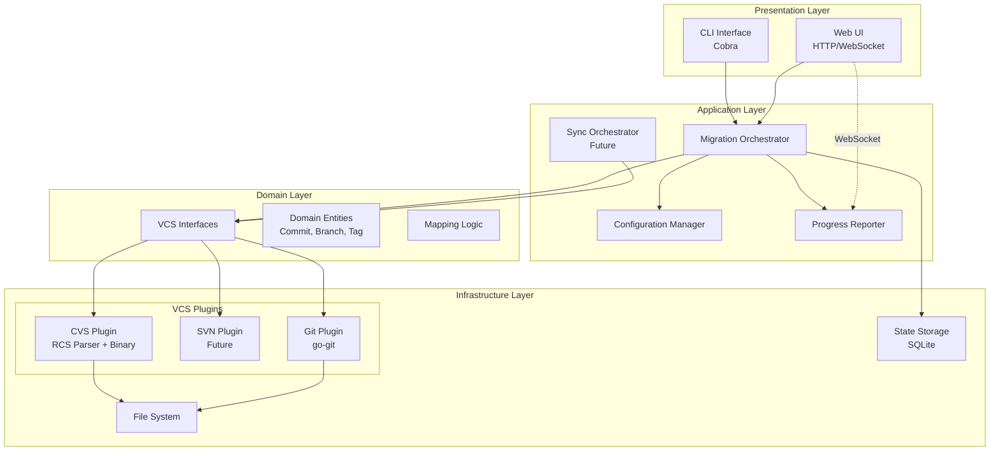
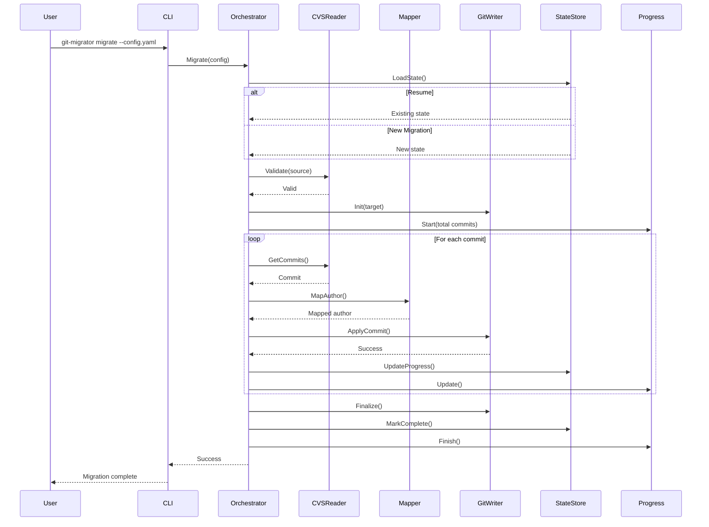
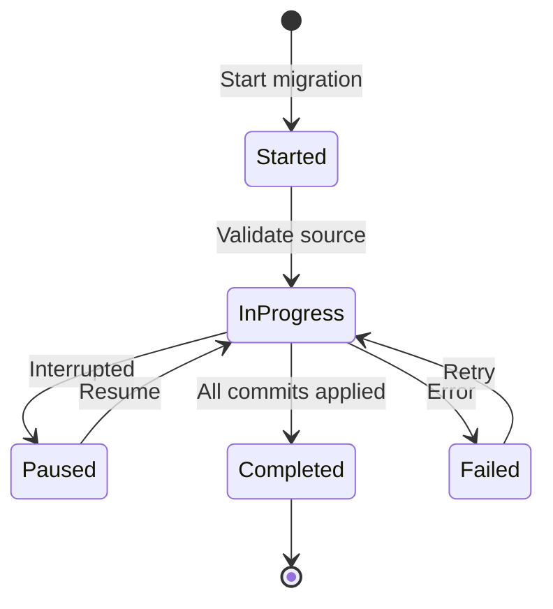
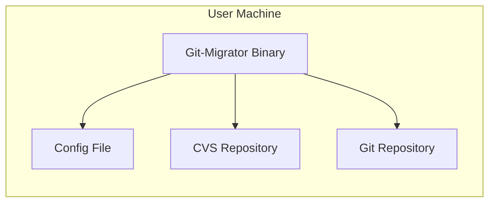
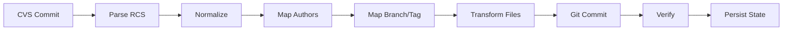
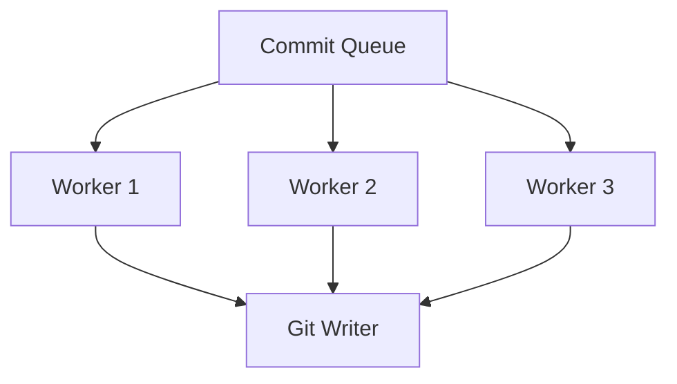
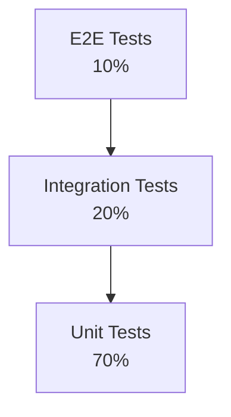

# Git-Migrator - Software Architecture

**Status:** Internal Planning Document  
**Last Updated:** 2025-01-18  
**Version:** 1.0

---

## Architecture Overview

Git-Migrator follows a **layered architecture** with **clean separation of concerns** and a **plugin-based VCS system** for maximum extensibility.

### High-Level Architecture



---

## Layer Responsibilities

### 1. Presentation Layer

**Purpose:** User interaction, input validation, output formatting

#### CLI Interface (Cobra)
- Command parsing and routing
- Flag handling
- User feedback (terminal output, progress bars)
- Configuration file loading

**Commands:**
```
git-migrator
├── migrate      # Run migration
├── sync         # Run sync (future)
├── analyze      # Analyze source repo
├── validate     # Validate configuration
├── authors      # Author mapping utilities
│   ├── extract  # Extract authors from source
│   └── generate # Generate mapping template
├── web          # Start web UI
└── version      # Version info
```

#### Web UI (HTTP + WebSocket)
- Migration wizard
- Real-time progress dashboard
- Configuration editor
- Log viewer
- WebSocket for live updates

**Endpoints:**
```
GET  /                    # Dashboard
GET  /api/migrations      # List migrations
POST /api/migrations      # Start migration
GET  /api/migrations/:id  # Get migration status
WS   /ws/progress/:id     # Real-time updates
```

### 2. Application Layer

**Purpose:** Orchestrate business logic, coordinate between layers

#### Migration Orchestrator
```go
type MigrationOrchestrator struct {
    source      VCSReader
    target      VCSWriter
    config      *Config
    mapper      *Mapper
    progress    ProgressReporter
    stateStore  StateStore
}

func (m *MigrationOrchestrator) Migrate(ctx context.Context) error {
    // 1. Validate source and target
    // 2. Load or create state
    // 3. Extract commits from source
    // 4. Apply transformations (mapping)
    // 5. Write to target
    // 6. Update state
    // 7. Report progress
}
```

**Responsibilities:**
- Coordinate migration workflow
- Handle resume capability
- Error recovery
- Progress reporting
- State persistence

#### Configuration Manager
```go
type Config struct {
    Source   SourceConfig
    Target   TargetConfig
    Mapping  MappingConfig
    Options  OptionsConfig
}
```

**Configuration Sources (Priority Order):**
1. CLI flags (highest priority)
2. Environment variables
3. Configuration file
4. Defaults (lowest priority)

#### Progress Reporter
```go
type ProgressReporter interface {
    Start(total int)
    Update(current int, message string)
    Finish()
    Error(err error)
}
```

**Implementations:**
- `TerminalProgress` - CLI progress bars
- `WebSocketProgress` - Real-time web updates
- `CompositeProgress` - Multiple reporters

### 3. Domain Layer

**Purpose:** Core business logic, domain models, VCS abstractions

#### VCS Interfaces (Plugin API)

```go
// VCSReader - Read from source VCS
type VCSReader interface {
    // Repository metadata
    Validate(path string) error
    GetInfo() (*RepositoryInfo, error)
    
    // History access
    ListBranches() ([]Branch, error)
    ListTags() ([]Tag, error)
    GetCommits(opts CommitOptions) (CommitIterator, error)
    
    // Content access
    GetFile(commit Commit, path string) ([]byte, error)
    ListFiles(commit Commit) ([]string, error)
}

// VCSWriter - Write to target VCS
type VCSWriter interface {
    Init(path string) error
    CreateBranch(name string, commit Commit) error
    CreateTag(name string, commit Commit) error
    ApplyCommit(commit Commit) error
    SetFile(path string, content []byte) error
    DeleteFile(path string) error
    Finalize() error
}

// VCSSyncer - Bidirectional sync (future)
type VCSSyncer interface {
    GetChanges(since time.Time) ([]Change, error)
    ApplyChange(change Change) error
    ResolveConflict(conflict Conflict) (Resolution, error)
}
```

#### Domain Entities

```go
type Commit struct {
    ID          string
    Author      Author
   Committer    Author
    Message     string
    Date        time.Time
    Files       []FileChange
    Parents     []string
}

type Author struct {
    Name  string
    Email string
}

type Branch struct {
    Name      string
    CommitID  string
}

type Tag struct {
    Name      string
    CommitID  string
    Message   string
}

type FileChange struct {
    Path     string
    Action   Action // Add, Modify, Delete
    Content  []byte
}
```

#### Mapping Logic

```go
type Mapper struct {
    authors  map[string]Author
    branches map[string]string
    tags     map[string]string
}

func (m *Mapper) MapAuthor(cvsUser string) Author
func (m *Mapper) MapBranch(cvsBranch string) string
func (m *Mapper) MapTag(cvsTag string) string
```

### 4. Infrastructure Layer

**Purpose:** External integrations, file system, databases

#### VCS Plugins

**CVS Plugin:**
```go
type CVSReader struct {
    path    string
    mode    CVSMode // RCS, Binary, Auto
    parser  *RCSParser
    client  *CVSClient
}

type CVSMode int
const (
    CVSModeRCS   CVSMode = iota  // Parse RCS files directly
    CVSModeBinary                 // Use cvs command
    CVSModeAuto                   // Try RCS first, fallback to binary
)
```

**Git Plugin:**
```go
type GitWriter struct {
    repo    *git.Repository
    path    string
}
```

#### State Storage (SQLite)

```sql
CREATE TABLE migrations (
    id TEXT PRIMARY KEY,
    source_path TEXT,
    target_path TEXT,
    status TEXT,
    started_at TIMESTAMP,
    completed_at TIMESTAMP,
    config TEXT
);

CREATE TABLE commits (
    id TEXT PRIMARY KEY,
    migration_id TEXT,
    source_id TEXT,
    target_id TEXT,
    status TEXT,
    applied_at TIMESTAMP,
    FOREIGN KEY (migration_id) REFERENCES migrations(id)
);

CREATE TABLE state (
    key TEXT PRIMARY KEY,
    value TEXT
);
```

---

## Component Interaction

### Migration Workflow



### Resume Capability



**State Tracking:**
- Last processed commit
- Successfully applied commits
- Failed commits with error details
- Checkpoint every N commits (configurable)

---

## Deployment Architecture

### Local Execution



**Requirements:**
- Go binary (single executable)
- File system access to source/target
- Optional: CVS binary (if not using RCS mode)

### Docker Execution

```mermaid
graph TB
    subgraph "Docker Container"
        A[Git-Migrator]
        B[Web Server :8080]
    end
    
    subgraph "Host Machine"
        C[/repos volume]
        D[/config volume]
        E[/data volume]
    end
    
    B --> |8080:8080| F[Browser]
    A --> C
    A --> D
    A --> E
```

**Docker Compose:**
```yaml
version: '3.8'
services:
  git-migrator:
    image: adamf123git/git-migrator:latest
    ports:
      - "8080:8080"
    volumes:
      - ./repos:/repos
      - ./config:/config
      - ./data:/data
    command: web --port 8080
```

---

## Data Flow

### Commit Processing Pipeline



**Transformation Steps:**
1. **Parse** - Extract commit from RCS file or CVS log
2. **Normalize** - Convert to internal Commit representation
3. **Map** - Apply author, branch, tag mappings
4. **Transform** - Handle file encoding, line endings
5. **Write** - Create Git commit
6. **Verify** - Check commit integrity
7. **Persist** - Update state for resume capability

---

## Security Architecture

### File System Access

**Principle:** Minimal necessary access

- Read-only: Source repository
- Read-write: Target repository
- Read-write: State database

**Docker Isolation:**
- Container runs as non-root user
- Volume mounts explicitly defined
- No privileged operations

### Input Validation

- Configuration file validation
- Path sanitization (prevent directory traversal)
- Author/branch/tag name validation

### Network Security (Web UI)

- localhost binding only by default
- No authentication in MVP (internal tool)
- Future: Add auth for enterprise use

---

## Performance Architecture

### Streaming Processing

```go
type CommitIterator interface {
    Next() (*Commit, error)
    HasNext() bool
}
```

**Benefit:** Don't load all commits into memory

**Memory Usage:**
- Constant memory footprint
- Only current commit + file contents in memory
- Configurable chunk size for state persistence

### Parallel Processing (Future)



**Challenge:** Git commits must be applied sequentially  
**Solution:** Parallel CVS reading, sequential Git writing

### Caching Strategy

- Cache parsed RCS files
- Cache author mappings
- Cache repository metadata

**Implementation:** In-memory LRU cache with configurable size

---

## Extensibility Points

### Adding New VCS System

1. Implement `VCSReader` interface (for source)
2. Implement `VCSWriter` interface (for target)
3. Register plugin in initialization
4. Add to configuration schema

```go
// Example: Adding SVN support
func init() {
    RegisterVCSPlugin("svn", &SVNPlugin{})
}

type SVNPlugin struct{}

func (p *SVNPlugin) NewReader(config SourceConfig) (VCSReader, error) {
    return &SVNReader{config.Path}, nil
}
```

### Adding New Transformation

```go
type Transformer interface {
    Transform(commit *Commit) error
}

// Example: Custom commit message transformer
type MessageTransformer struct{}

func (t *MessageTransformer) Transform(commit *Commit) error {
    commit.Message = strings.ReplaceAll(commit.Message, "[CVS]", "")
    return nil
}
```

### Adding New Progress Reporter

```go
// Example: Slack integration
type SlackProgressReporter struct {
    webhook string
}

func (r *SlackProgressReporter) Update(current int, message string) {
    // Post to Slack
}
```

---

## Testing Architecture

### Test Pyramid



### Test Categories

**Unit Tests:**
- VCS parsing logic
- Mapping functions
- Configuration handling
- Domain entities

**Integration Tests:**
- Full VCS operations (with real file system)
- State persistence
- Migration orchestration

**E2E Tests:**
- CLI workflows
- Web UI workflows
- Docker execution

### Test Fixtures

```
test/fixtures/
  cvs/
    simple/          # 5 commits, linear history
    branches/        # Multiple branches
    tags/            # Tagged releases
    binary/          # Binary files
    unicode/         # Unicode content
    large/           # 1000+ commits
    
  expected/
    simple.git/      # Expected Git output
    branches.git/
    tags.git/
```

### Mocking Strategy

```go
// Mock VCSReader for testing
type MockVCSReader struct {
    commits []Commit
    branches []Branch
    tags []Tag
}

func (m *MockVCSReader) GetCommits(opts CommitOptions) ([]Commit, error) {
    return m.commits, nil
}
```

---

## Monitoring & Observability

### Logging

**Structured Logging:**
```go
log.Info("Starting migration",
    "source", config.Source.Path,
    "target", config.Target.Path,
    "mode", "rcs",
)
```

**Log Levels:**
- ERROR: Failures, exceptions
- WARN: Unexpected but handled situations
- INFO: High-level progress (migration start/stop)
- DEBUG: Detailed progress (every commit)
- TRACE: Very detailed (file contents)

### Metrics (Future)

- Migration duration
- Commits per second
- Memory usage
- Error rate

### Health Checks

- Configuration validation
- Source repository accessibility
- Target repository writability
- State database connectivity

---

## Related Documents

- [Project Plan](./project-plan.md) - Overall project goals and requirements
- [Software Design](./software-design.md) - Implementation details
- [Roadmap](./roadmap.md) - Development timeline

---

## Change Log

| Date | Version | Changes |
|------|---------|---------|
| 2025-01-18 | 1.0 | Initial architecture document |
